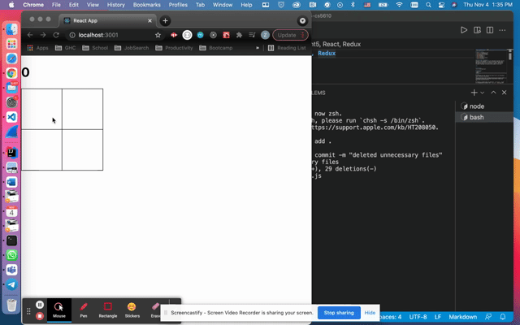

# Mini Assignment5, React, Redux
> React Redux mini app

## Table of contents
* [General info](#general-info)
* [Screenshots](#screenshots)
* [Technologies](#technologies)
* [Setup](#setup)
* [Features](#features)
* [Status](#status)
* [Inspiration](#inspiration)
* [Contact](#contact)

## General info/ Instructions
The goal of this assignment is to get comfortable using React and more experience with JavaScript.  You will be creating a 2X2 grid, where each square on that grid can be turned “on” or “off”.  Additionally, each time you select a cell on this grid, a counter at the top will increment or decrement to show the current number of “on” cells.  

<br>


## Screenshots


## Technologies
* JavaScript
* React
* Redux

## Setup
First download the code, then you can install [Visual Code IDE](https://code.visualstudio.com/download).
<br>
You would need React, Node and Redux installed on your computer. Some installation instructions can be found: [here](https://reactjs.org/docs/create-a-new-react-app.html).
<br>

On terminal or command prompt, You would run ```npm install``` to get all the dependencies installed. Then ```npm start``` should open the app in a browser tab. If it doesn't it usually shows some errors on the browser page. 


## Features
List of features ready and TODOs for future development
* Use of React
* Use of Redux
* Use of JavaScript
* Change of color once you click is functional


To-do list:
* improve the organization of code


## Status
Project is: _finished_

## Inspiration
Mini Assignment 5

## Contact
 <br>
Yalda Ali Aghazadeh : Front End Developer/ Designer
[Github](https://github.com/zahraaliaghazadeh) ,
[LinkedIn](www.linkedin.com/in/zahraaliaghazadeh)


<hr>
<hr>
## Getting Started with Create React App

This project was bootstrapped with [Create React App](https://github.com/facebook/create-react-app).

## Available Scripts

In the project directory, you can run:

### `npm start`

Runs the app in the development mode.\
Open [http://localhost:3000](http://localhost:3000) to view it in the browser.

The page will reload if you make edits.\
You will also see any lint errors in the console.

### `npm test`

Launches the test runner in the interactive watch mode.\
See the section about [running tests](https://facebook.github.io/create-react-app/docs/running-tests) for more information.

### `npm run build`

Builds the app for production to the `build` folder.\
It correctly bundles React in production mode and optimizes the build for the best performance.

The build is minified and the filenames include the hashes.\
Your app is ready to be deployed!

See the section about [deployment](https://facebook.github.io/create-react-app/docs/deployment) for more information.

### `npm run eject`

**Note: this is a one-way operation. Once you `eject`, you can’t go back!**

If you aren’t satisfied with the build tool and configuration choices, you can `eject` at any time. This command will remove the single build dependency from your project.

Instead, it will copy all the configuration files and the transitive dependencies (webpack, Babel, ESLint, etc) right into your project so you have full control over them. All of the commands except `eject` will still work, but they will point to the copied scripts so you can tweak them. At this point you’re on your own.

You don’t have to ever use `eject`. The curated feature set is suitable for small and middle deployments, and you shouldn’t feel obligated to use this feature. However we understand that this tool wouldn’t be useful if you couldn’t customize it when you are ready for it.

## Learn More

You can learn more in the [Create React App documentation](https://facebook.github.io/create-react-app/docs/getting-started).

To learn React, check out the [React documentation](https://reactjs.org/).

### Code Splitting

This section has moved here: [https://facebook.github.io/create-react-app/docs/code-splitting](https://facebook.github.io/create-react-app/docs/code-splitting)

### Analyzing the Bundle Size

This section has moved here: [https://facebook.github.io/create-react-app/docs/analyzing-the-bundle-size](https://facebook.github.io/create-react-app/docs/analyzing-the-bundle-size)

### Making a Progressive Web App

This section has moved here: [https://facebook.github.io/create-react-app/docs/making-a-progressive-web-app](https://facebook.github.io/create-react-app/docs/making-a-progressive-web-app)

### Advanced Configuration

This section has moved here: [https://facebook.github.io/create-react-app/docs/advanced-configuration](https://facebook.github.io/create-react-app/docs/advanced-configuration)

### Deployment

This section has moved here: [https://facebook.github.io/create-react-app/docs/deployment](https://facebook.github.io/create-react-app/docs/deployment)

### `npm run build` fails to minify

This section has moved here: [https://facebook.github.io/create-react-app/docs/troubleshooting#npm-run-build-fails-to-minify](https://facebook.github.io/create-react-app/docs/troubleshooting#npm-run-build-fails-to-minify)
